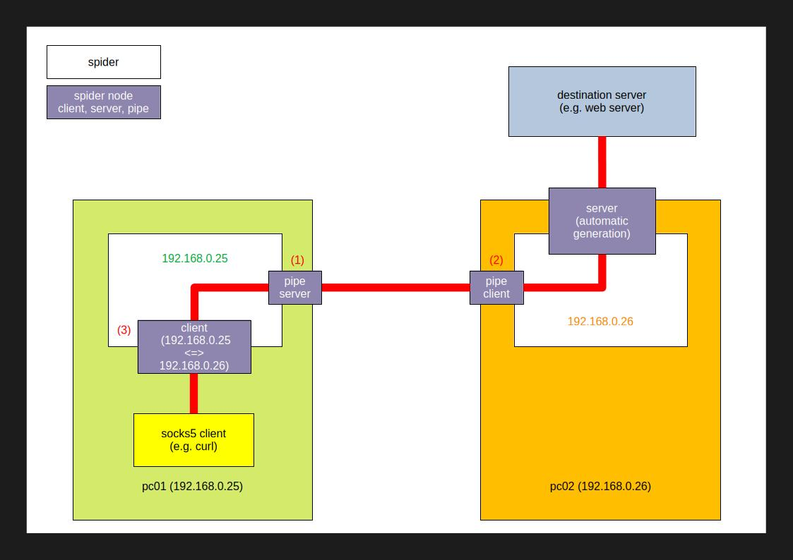

# spider (Linux)

socks5 proxy tunnel tool

## Installation
### Install dependencies
- g++ (C++20)

### Install
1. download files
```
git clone https://github.com/shuichiro-endo/spider.git
```

2. build
```
cd spider/Linux
make
```
> [!NOTE]
> If you want to display debug messages, please uncomment #define statement (//#define _DEBUG) in spider.hpp.
> 
> And then build it.
- spider.hpp (uncomment #define statement (//#define _DEBUG))
```
#define _DEBUG
```


## Usage
- help
> [!NOTE]
> In auto mode with the -r option, routing information is automatically exchanged between spiders.
> 
> In self mode, routing information is not exchanged between spiders, so please set the routing information manually.
>
> If the -r option is not set, it is in auto mode by default.

```
> ./spider -h

                 -.                                 _//                   
           .=  :*=--::                       _/     _//                   
      ....  =:::::-==++-::.   _//// _/ _//          _//   _//    _/ _///  
      .:..:--::::..--:..     _//    _/  _// _// _// _// _/   _//  _//     
    .:::==-::.:-===.           _/// _/   _//_//_/   _//_///// _// _//     
  :-.  ::+=-:--=:=*-             _//_// _// _//_/   _//_/         _//     
         -+: ++-  -*-        _// _//_//     _// _// _//  _////   _///     
        :*-  :*-   .:.              _//                                   
        =-    -:                  Linux Ver: 0.6  Author: Shuichiro Endo  


usage   : ./spider -i spider_ip
        : [-r routing_mode(auto:a self:s)]
        : [-e x(xor encryption)] [-k key(hexstring)]
        : [-e a(aes-256-cbc encryption)] [-k key(hexstring)] [-v iv(hexstring)]
example : ./spider -i 192.168.0.10
        : ./spider -i 192.168.0.10 -r s
        : ./spider -i 192.168.0.10 -e x -k deadbeef
        : ./spider -i 192.168.0.10 -e a -k 47a2baa1e39fa16752a2ea8e8e3e24256b3c360f382b9782e2e57d4affb19f8c -v c87114c8b36088074c7ec1398f5c168a
        : ./spider -i fe80::xxxx:xxxx:xxxx:xxxx%eth0

```

- run
> [!NOTE]
> The -i option sets the IP address of the network interface.
> 
> Some IP addresses may not work correctly. (e.g. 127.0.0.1, ::1, 0.0.0.0)

```
> ./spider -i 192.168.0.25

                 -.                                 _//                   
           .=  :*=--::                       _/     _//                   
      ....  =:::::-==++-::.   _//// _/ _//          _//   _//    _/ _///  
      .:..:--::::..--:..     _//    _/  _// _// _// _// _/   _//  _//     
    .:::==-::.:-===.           _/// _/   _//_//_/   _//_///// _// _//     
  :-.  ::+=-:--=:=*-             _//_// _// _//_/   _//_/         _//     
         -+: ++-  -*-        _// _//_//     _// _// _//  _////   _///     
        :*-  :*-   .:.              _//                                   
        =-    -:                  Linux Ver: 0.6  Author: Shuichiro Endo  


----------     spider     ----------
 spider ip          : 192.168.0.25
 routing mode       : auto
 xor encryption     : off
 xor key hex string : 
 aes encryption     : off
 aes key hex string : 
 aes iv hex string  : 
---------- spider command ----------
 1: add node (spider client)
 2: add node (spider pipe)
 3: show node information
 4: show routing table
 5: edit routing table
 6: add node (spider client udp)
 0: exit
------------------------------------

command >

```

- 1: add node (spider client)
> [!NOTE]
> The startup location of the spider server node is determined by the 'destination spider ip' when adding the spider client node.
>
> Please set the forwarder timeout to a larger value. (The default is 30 seconds.)

```
command > 1
[+] add node (spider client)
client listen port           > 9050
destination spider ip        > 192.168.0.30
recv/send tv_sec  (timeout 0-60 sec)           > 3
recv/send tv_usec (timeout 0-1000000 microsec) > 0
forwarder tv_sec  (timeout 0-3600 sec)         > 30
forwarder tv_usec (timeout 0-1000000 microsec) > 0

client listen ip        : 192.168.0.25
client listen port      : 9050
destination spider ip   : 192.168.0.30
recv/send tv_sec        :       3 sec
recv/send tv_usec       :       0 microsec
forwarder_tv_sec        :      30 sec
forwarder_tv_usec       :       0 microsec

ok? (yes:y no:n quit:q) > y

```

- 2: add node (spider pipe) 
1. pipe (server)
```
command > 2
[+] add node (spider pipe)
mode (client:c server:s)    > s
pipe listen port            > 1234

mode                    : s
pipe ip                 : 192.168.0.25
pipe listen port        : 1234

ok? (yes:y no:n quit:q) > y
```
2. pipe (client)
```
command > 2
[+] add node (spider pipe)
mode (client:c server:s)    > c
pipe destination ip         > 192.168.0.25
pipe destination port       > 1234

mode                    : c
pipe ip                 : 192.168.0.26
pipe destination ip     : 192.168.0.25
pipe destination port   : 1234

ok? (yes:y no:n quit:q) > y
```

- 3: show node information
```
command > 3
[+] show node information
---------------------------------------------------------------------------------------------------------------------------------------------- client -----------------------------------------------------------------------------------------------------------------------------------------------
|type  |connection id|client id |server id |client ip                                     |client listen port|client port|destination spider ip                         |target ip                                     |target port|client socket|tv_sec |tv_usec|forwarder_tv_sec|forwarder_tv_usec|
-----------------------------------------------------------------------------------------------------------------------------------------------------------------------------------------------------------------------------------------------------------------------------------------------------
|socks5|   1138453384|         0|         0|192.168.0.25                                  |              9050|           |192.168.0.31                                  |                                              |           |            4|      3|      0|              10|                0|
|udp   |   2924664153|1512643263|1706946128|192.168.0.25                                  |             10053|           |192.168.0.31                                  |1.1.1.1                                       |         53|            6|      3|      0|              10|                0|
-----------------------------------------------------------------------------------------------------------------------------------------------------------------------------------------------------------------------------------------------------------------------------------------------------

---------------------------------------------------------------------------------------------------------------------------------------- server -----------------------------------------------------------------------------------------------------------------------------------------
|connection id|client id |server id |server ip                                     |server port|client destination ip                         |server socket|target ip                                     |target port|target socket|tv_sec |tv_usec|forwarder_tv_sec|forwarder_tv_usec|
-----------------------------------------------------------------------------------------------------------------------------------------------------------------------------------------------------------------------------------------------------------------------------------------
-----------------------------------------------------------------------------------------------------------------------------------------------------------------------------------------------------------------------------------------------------------------------------------------

----------------------------------------------------------------------------- pipe -------------------------------------------------------------------------------
|pipe id   |mode|pipe ip                                       |pipe listen port|pipe destination ip                           |pipe destination port|pipe socket|
------------------------------------------------------------------------------------------------------------------------------------------------------------------
|3918819576|c   |192.168.0.25                                  |                |192.168.0.31                                  |                 1031|          3|
------------------------------------------------------------------------------------------------------------------------------------------------------------------
```

- 4: show routing table
```
command > 4
[+] show routing table
---------------------------------------- routing  table ----------------------------------------
|mode|ip address                                    |metric|pipe id   |time                    |
------------------------------------------------------------------------------------------------
|-   |192.168.0.25                                  |     0|         0|Thu Feb 13 10:54:14 2025|
|a   |192.168.0.26                                  |     1|2832142960|Thu Feb 13 10:54:29 2025|
|a   |192.168.0.27                                  |     2|2832142960|Thu Feb 13 10:54:29 2025|
------------------------------------------------------------------------------------------------
```

- 5: edit routing table
1. add route
```
command > 5
[+] edit routing table
---------------------------------------- routing  table ----------------------------------------
|mode|ip address                                    |metric|pipe id   |time                    |
------------------------------------------------------------------------------------------------
|-   |192.168.0.25                                  |     0|         0|Thu Feb 13 10:45:52 2025|
------------------------------------------------------------------------------------------------

edit mode (add:a delete:d quit:q)  > a
ip address                         > 192.168.0.27
metric (0 < metric <= 255)         > 2
----------------------------------------------------------------------------- pipe -------------------------------------------------------------------------------
|pipe id   |mode|pipe ip                                       |pipe listen port|pipe destination ip                           |pipe destination port|pipe socket|
------------------------------------------------------------------------------------------------------------------------------------------------------------------
| 760909584|c   |192.168.0.25                                  |                |192.168.0.26                                  |                 1026|          3|
------------------------------------------------------------------------------------------------------------------------------------------------------------------

pipe id                             > 760909584

edit mode       : a
ip address      : 192.168.0.27
metric          : 2
pipe id         :  760909584

ok? (yes:y no:n quit:q)             > y
---------------------------------------- routing  table ----------------------------------------
|mode|ip address                                    |metric|pipe id   |time                    |
------------------------------------------------------------------------------------------------
|-   |192.168.0.25                                  |     0|         0|Thu Feb 13 10:45:52 2025|
|s   |192.168.0.27                                  |     2| 760909584|Thu Feb 13 10:46:56 2025|
------------------------------------------------------------------------------------------------
```
2. delete route
```
command > 5
[+] edit routing table
---------------------------------------- routing  table ----------------------------------------
|mode|ip address                                    |metric|pipe id   |time                    |
------------------------------------------------------------------------------------------------
|-   |192.168.0.25                                  |     0|         0|Thu Feb 13 10:45:52 2025|
|s   |192.168.0.27                                  |     2| 760909584|Thu Feb 13 10:46:56 2025|
------------------------------------------------------------------------------------------------

edit mode (add:a delete:d quit:q)  > d
ip address                         > 192.168.0.27

edit mode       : d
ip address      : 192.168.0.27

ok? (yes:y no:n quit:q)            > y
---------------------------------------- routing  table ----------------------------------------
|mode|ip address                                    |metric|pipe id   |time                    |
------------------------------------------------------------------------------------------------
|-   |192.168.0.25                                  |     0|         0|Thu Feb 13 10:45:52 2025|
------------------------------------------------------------------------------------------------
```

- 6: add node (spider client udp)
> [!IMPORTANT]
> This is not SOCKS5 connection. (UDP over TCP)
> 
> The server starts when the client is created. Therefore, it is necessary to create a route in advance using pipes.

```
command > 6
[+] add node (spider client udp)
[!] This is not SOCKS5 connection. (UDP over TCP)
client listen port                             > 10053
destination spider ip                          > 192.168.0.26
target ip (ipv4<16, domainname<256, ipv6<46)   > 1.1.1.1
target port                                    > 53
recv/send tv_sec  (timeout 0-60 sec)           > 3
recv/send tv_usec (timeout 0-1000000 microsec) > 0
forwarder tv_sec  (timeout 0-3600 sec)         > 10
forwarder tv_usec (timeout 0-1000000 microsec) > 0

client listen ip        : 192.168.0.25
client listen port      : 10053
destination spider ip   : 192.168.0.26
target ip               : 1.1.1.1
target port             : 53
recv/send tv_sec        :       3 sec
recv/send tv_usec       :       0 microsec
forwarder_tv_sec        :      10 sec
forwarder_tv_usec       :       0 microsec
FORWARDER_UDP_TIMEOUT   :     300 sec
ok? (yes:y no:n quit:q) > y
```
> [!NOTE]
> Please set the 'client listen port' to the destination port of the UDP connection tool. (e.g. dig @192.168.0.25 -p 10053 google.com +notcp)
> 
> The server startup time is set to 5 minutes (spider.hpp FORWARDER_UDP_TIMEOUT) by default. The timeout period is reset each time communication occurs.

## Example


1. add spider pipe server node (1)
```
./spider -i 192.168.0.25

                 -.                                 _//                   
           .=  :*=--::                       _/     _//                   
      ....  =:::::-==++-::.   _//// _/ _//          _//   _//    _/ _///  
      .:..:--::::..--:..     _//    _/  _// _// _// _// _/   _//  _//     
    .:::==-::.:-===.           _/// _/   _//_//_/   _//_///// _// _//     
  :-.  ::+=-:--=:=*-             _//_// _// _//_/   _//_/         _//     
         -+: ++-  -*-        _// _//_//     _// _// _//  _////   _///     
        :*-  :*-   .:.              _//                                   
        =-    -:                  Linux Ver: 0.1  Author: Shuichiro Endo  


----------     spider     ----------
 spider ip          : 192.168.0.25
 xor encryption     : off
 xor key hex string : 
---------- spider command ----------
 1: add node (spider client)
 2: add node (spider pipe)
 3: show node information
 4: show routing table
 0: exit
------------------------------------

command > 2
[+] add node (spider pipe)
mode (client:c server:s)    > s
pipe listen port            > 1026

mode                    : s
pipe ip                 : 192.168.0.25
pipe listen port        : 1026

ok? (yes:y no:n quit:q) > y

```

2. add spider pipe client node (2)
```
./spider -i 192.168.0.26

                 -.                                 _//                   
           .=  :*=--::                       _/     _//                   
      ....  =:::::-==++-::.   _//// _/ _//          _//   _//    _/ _///  
      .:..:--::::..--:..     _//    _/  _// _// _// _// _/   _//  _//     
    .:::==-::.:-===.           _/// _/   _//_//_/   _//_///// _// _//     
  :-.  ::+=-:--=:=*-             _//_// _// _//_/   _//_/         _//     
         -+: ++-  -*-        _// _//_//     _// _// _//  _////   _///     
        :*-  :*-   .:.              _//                                   
        =-    -:                  Linux Ver: 0.1  Author: Shuichiro Endo  


----------     spider     ----------
 spider ip          : 192.168.0.26
 xor encryption     : off
 xor key hex string : 
---------- spider command ----------
 1: add node (spider client)
 2: add node (spider pipe)
 3: show node information
 4: show routing table
 0: exit
------------------------------------

command > 2
[+] add node (spider pipe)
mode (client:c server:s)    > c
pipe destination ip         > 192.168.0.25
pipe destination port       > 1026

mode                    : c
pipe ip                 : 192.168.0.26
pipe destination ip     : 192.168.0.25
pipe destination port   : 1026

ok? (yes:y no:n quit:q) > y

```

3. add spider client node (3)
> [!NOTE]
> The startup location of the spider server node is determined by the 'destination spider ip' when adding the spider client node.

```
----------     spider     ----------
 spider ip          : 192.168.0.25
 xor encryption     : off
 xor key hex string : 
---------- spider command ----------
 1: add node (spider client)
 2: add node (spider pipe)
 3: show node information
 4: show routing table
 0: exit
------------------------------------

command > 1
[+] add node (spider client)
client listen port           > 9050
destination spider ip        > 192.168.0.26
recv/send tv_sec  (timeout 0-60 sec)           > 3
recv/send tv_usec (timeout 0-1000000 microsec) > 0
forwarder tv_sec  (timeout 0-3600 sec)         > 30
forwarder tv_usec (timeout 0-1000000 microsec) > 0

client listen ip        : 192.168.0.25
client listen port      : 9050
destination spider ip   : 192.168.0.26
recv/send tv_sec        :       3 sec
recv/send tv_usec       :       0 microsec
forwarder_tv_sec        :      30 sec
forwarder_tv_usec       :       0 microsec

ok? (yes:y no:n quit:q) > y

```

4. check node and routing table
- show node information (pc01 192.168.0.25)
```
----------     spider     ----------
 spider ip          : 192.168.0.25
 xor encryption     : off
 xor key hex string : 
---------- spider command ----------
 1: add node (spider client)
 2: add node (spider pipe)
 3: show node information
 4: show routing table
 0: exit
------------------------------------

command > 3
[+] show node information
--------------------------------------------------------------------------------------------------- client -----------------------------------------------------------------------------------------------------
|connection id|client id |server id |client ip                                     |client port|destination spider ip                         |client socket|tv_sec |tv_usec|forwarder_tv_sec|forwarder_tv_usec|
----------------------------------------------------------------------------------------------------------------------------------------------------------------------------------------------------------------
|   2654369324|         0|         0|192.168.0.25                                  |       9050|192.168.0.26                                  |            6|      3|      0|              30|                0|
----------------------------------------------------------------------------------------------------------------------------------------------------------------------------------------------------------------

--------------------------------------------------------------------------------------------------------------------------------- server ----------------------------------------------------------------------------------------------------------------------------------
|connection id|client id |server id |server ip                                     |server port|client destination ip                         |server socket|target ip                                     |target port|tv_sec |tv_usec|forwarder_tv_sec|forwarder_tv_usec|
---------------------------------------------------------------------------------------------------------------------------------------------------------------------------------------------------------------------------------------------------------------------------
---------------------------------------------------------------------------------------------------------------------------------------------------------------------------------------------------------------------------------------------------------------------------

----------------------------------------------------------------------------- pipe -------------------------------------------------------------------------------
|pipe id   |mode|pipe ip                                       |pipe listen port|pipe destination ip                           |pipe destination port|pipe socket|
------------------------------------------------------------------------------------------------------------------------------------------------------------------
|1176964916|-   |192.168.0.25                                  |                |192.168.0.26                                  |                51668|          4|
|1567359876|s   |192.168.0.25                                  |            1026|                                              |                     |          3|
------------------------------------------------------------------------------------------------------------------------------------------------------------------

```
- show routing table (pc01 192.168.0.25)
```
----------     spider     ----------
 spider ip          : 192.168.0.25
 xor encryption     : off
 xor key hex string : 
---------- spider command ----------
 1: add node (spider client)
 2: add node (spider pipe)
 3: show node information
 4: show routing table
 0: exit
------------------------------------

command > 4
[+] show routing table
---------------------------------------- routing  table ----------------------------------------
|type|ip address                                    |metric|pipe id   |time                    |
------------------------------------------------------------------------------------------------
|c   |192.168.0.25                                  |     0|         0|Sun Feb  9 13:03:06 2025|
|c   |192.168.0.26                                  |     1|1176964916|Sun Feb  9 13:06:08 2025|
|s   |192.168.0.25                                  |     0|         0|Sun Feb  9 13:03:06 2025|
|s   |192.168.0.26                                  |     1|1176964916|Sun Feb  9 13:06:08 2025|
------------------------------------------------------------------------------------------------

```

5. run socks5 client (e.g. curl)
```
curl -v -x socks5h://192.168.0.25:9050 https://www.google.com
```
