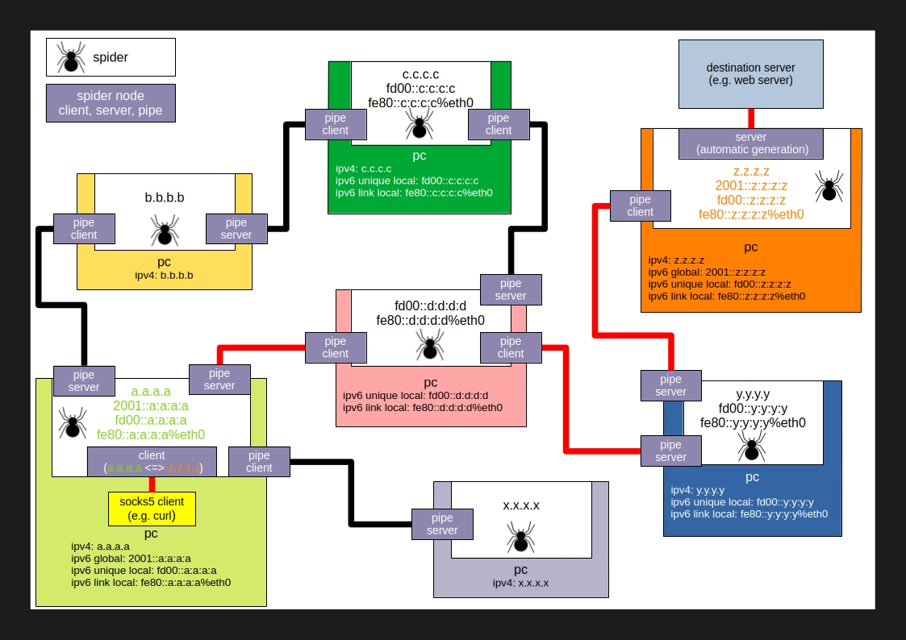

# spider

socks5 proxy tunnel tool

## How it works

The spider has the following features:

- Connects to multiple spider nodes
- Generates and exchanges routing information between spider nodes
- Automatically generates a spider server node at the desired spider node
- Automatically forwards SOCKS5 packets to the desired spider node
- Forwards packets from the SOCKS5 client from the spider client to the desired spider server node
- Establishes a connection to the destination server from the spider server node

## License
This project is licensed under the MIT License.

See the [LICENSE](https://github.com/shuichiro-endo/spider/blob/main/LICENSE) file for details.
